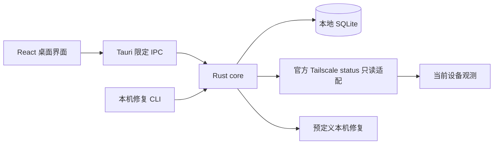
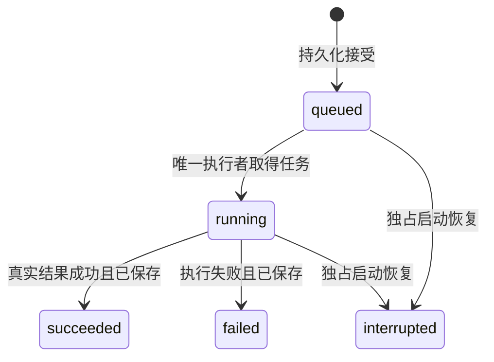

> 2026-09-24 更新：用户已撤回“Agent 仅修复、没有操控权”限制。本文件记录已构建的 0.1.0 基础能力；其限制不再约束后续远程任务开发。当前产品范围见 CONTEXT.md。

# Design

## Context

动机见 [proposal.md](proposal.md)。本变更横跨桌面、存储、权限、视觉与发布，需要设计文档。

已检查的起点：

| 区域 | 已有内容 | 尚缺与风险 |
| --- | --- | --- |
| `src/` | React/TypeScript 四页功能骨架、真实 Tauri IPC、4 项设备状态测试 | 基础灰度样式；旧“UI 待确认”文案；设置和任务请求存在错误反馈/重复请求语义需核对 |
| `src-tauri/` | Tauri 2、单实例、主窗口命令白名单、本地数据路径 | 图标引用对应文件缺失；未实际打包；只把执行保存失败写 stderr |
| `crates/core/` | SQLite 迁移、设备上下文、白名单任务、请求去重、恢复 | `sqlx::migrate!` 编译失败；当前内存锁不能跨进程；Tailscale 输出在读完后才检查大小 |
| `crates/agent/` | 本机检查、重建、历史三个 CLI 子命令 | 无网络监听；数据目录可传入但无自有数据识别；无跨进程所有权；失败结果可能仍以退出码 0 返回 |
| 工程 | npm/Cargo 锁文件、PRD、权限边界说明 | 尚无 GitHub 仓库、CI 与安装验证；项目内 `work/npm-cache` 未被忽略 |

本机前端类型检查和 4 项测试通过。Rust 测试尚未编译通过，不能认为既有 Rust 测试已经验证行为。界面概念图已经用内置 GPT Image 生成并修正，只含虚构示例。

## Goals / Non-Goals

**Goals:**

- 用现有 Rust core 统一桌面与本机 CLI 的规则，使权限校验不依赖 UI。
- 以可恢复的本地持久化支持任务结果和设备偏好，可靠表达“未知”。
- 将视觉参考转成可访问的真实组件，保留三平台共用逻辑和平台适配。
- 建立从锁定依赖到安装验证的交付链，分开记录“编译成功”和“用户可安装”。

**Non-Goals:**

- 此变更不新增网络执行服务、远程命令、脚本、SSH、RDP、文件传输或系统管理。
- 不静默登录、切换账户、审批设备或配置 Tailscale 路由。
- 不将用户“修复”的未明确部分推断为任意自动运维授权。远程能力另立变更，不通过本次基础里程碑宣称完成原 PRD。
- 此次 OpenSpec 提案阶段只完成规范、设计与任务；产品代码在后续 apply 阶段实施。

## Decisions

### 1. 保留 Tauri 2 + React + Rust core + SQLite

复用当前工作区，UI 负责展示和输入；Tauri IPC 负责本机桥接与输入校验；core 负责状态适配、存储、修复策略。CLI 调用同一 core，但不是远程服务。

备选为 Electron 或浏览器 + 自建本地 HTTP 服务；前者偏离用户指定技术，后者增加本里程碑不需要的监听与授权面，因此不采用。SQLite 事务适合现有单用户本地数据；不增加云数据库。

### 2. Tailscale 作为已安装的外部网络依赖

固定参数运行官方 CLI 的 `status --json`，不经过 shell，不接受 UI 传入可执行文件或命令参数。沿用 8 秒超时，并改为有界读取 stdout/stderr，超过 16 MiB 时终止读取和子进程，错误文本最多展示 800 字符。对新字段容忍，对关键身份缺失失败关闭。

官方 CLI 文档明确支持 JSON 输出，同时提醒格式可能变化，因此采用独立适配器与脱敏格式样例测试，不把返回结构视为永不变化的公共数据库模式。[Tailscale CLI 文档](https://tailscale.com/docs/reference/tailscale-cli)

备选 LocalAPI 或管理 API：本阶段不引入额外特权通道、管理凭证或嵌入式网络守护进程。三平台分别验证实际官方安装路径；找不到兼容 CLI 时解释原因，不把它等同于“无设备”。

新设备通过官方安装、登录与按需审批加入；应用随后重新发现。引导对应官方新增设备流程，不代替身份认证。[Tailscale quickstart](https://tailscale.com/docs/how-to/quickstart)

### 3. 设备身份、缓存和选择必须一起受上下文约束

数据库主键保留 `(context_id, node_id)`。当前上下文以有效 Self 节点与网络身份摘要计算；摘要是本地隔离标识，不是登录凭证。设备别名/收藏不写入 Tailscale。

成功刷新事务中将旧条目标为不可见，再合并当次观测。UI 使用当前快照决定在线状态；`visible=false` 或超过一次成功观测范围的条目标为历史。刷新失败保留同一已确认上下文的屏幕内容时也必须整体标旧。上下文变化或无法确认时清空选择。

修订现有 `cached_devices`：不能仅依赖持久化 `last_context` 暴露上次账户目录作为当前列表；调用须带有效当前上下文，后端校验。程序重启未识别账户前不自动加载旧目录。

备选将所有历史节点混排或仅使用主机名容易误选，因此不用。原目录中的旧节点可以作为清楚标记的历史观测保留，但不会取得执行能力。

### 4. 数据库明确属于本产品，迁移可失败且不丢数据

桌面固定使用 Tauri 当前用户本地应用数据目录的 `controller.db`。CLI 使用其独立 `agent.db`，且不伪装为桌面数据库修复器；其 `--data-dir` 只指定 TailTask 数据目录，不是任意数据库路径。

新增自有存储识别和模式版本校验：新建数据在成功迁移时写产品标记；对已有文件先只读检查产品标记或本项目原有完整迁移表与结构，再决定是否兼容升级。不认识的非空数据库拒绝迁移；不以 `CREATE TABLE IF NOT EXISTS` 直接认领任意文件。已发布的迁移保持不可变，新变化用后续迁移。

启用 SQLite 外键、WAL、忙等待和参数绑定；不存储管理 API 密钥。首次变更兼容现有骨架数据库；升级前使用一致性备份（SQLite backup 或关闭所有连接后的检查点备份），不能在 WAL 活跃时仅复制主文件。

备选以 JSON 文件保存任务无法便利地提供原子去重与事件一致性，因此不采用。

### 5. 限定动作、幂等和恢复属于服务端行为

保留严格 RepairAction 枚举与 `deny_unknown_fields`，数据库约束同样只接受两个动作。任务接口没有 command、脚本、进程或远程目标参数。数据库检查用固定 `quick_check`，索引重建使用固定 `REINDEX`；无网络执行入口。

状态机：

请求编号唯一，同号同动作返回原任务，同号异动作报冲突。事务提交成功后才通知执行。UI 在确认收到“已接受”时即分开处理该提交与后续详情读取；详情读取失败不得让下次提交创建重复动作。明确新一次运行才产生新 UUID。

排队/执行中遗留只在启动恢复时转中断，绝不自动重跑。终态与结果事件同事务写入；已接受任务执行出错时尽力记录失败；数据库本身无法保存结果时通过桌面错误通道明确报告“状态待核实”，而不是只写 stderr 或伪造终态。CLI 对任务失败返回非零退出码。

备选自动重放未知结果会重复副作用；仅 UI 禁用按钮不能阻止直接 IPC 调用，因此都不采用。

### 6. 同一数据目录的进程所有权优先于恢复

打开数据库和运行恢复前取得按规范化目录定位的 OS 级文件锁，进程生命周期内持有；进程死亡后由 OS 释放。Rust 内存互斥锁继续负责同一进程内串行执行。桌面单实例插件辅助窗口聚焦，但不能替代 CLI 数据目录锁。两者失败均显示清晰错误。

通过两个独立进程的临时目录测试验证竞争及异常退出后的锁释放。不能用持久化布尔“正在运行”或仅 PID 文件作为独占依据，避免崩溃遗留和 PID 复用。

### 7. 把 GPT Image 参考落实为组件与视觉令牌

选定设计参考：`docs/design/tailtask-ui-concept-v1.png`；提示词记录：`docs/design/image-prompts.md`。两条示例任务均属于“工作电脑（本机）”。图中日期、IP、系统版本与 Tailscale 版本全部是示例；现有数据模型未提供的对端版本不在实装中补造。

实现方向（设计提案，可在不改变交互契约时微调）：

| 项目 | 实现基准 |
| --- | --- |
| 底色 / 表面 | 浅灰蓝 #F6F8FC / 白色 #FFFFFF |
| 正文 / 次级字 | #152238 / #516079 |
| 主色 / 主色悬停 | #0B5FE8 / #084BBC |
| 边框 / 焦点 | #DDE5EF / 2px 主色外框 |
| 状态 | 成功、警告、错误有文字与图标；校验实际配色对比度 |
| 字体 | 系统中文无衬线；正文 14–16px；地址与编号使用系统等宽字体 |
| 间距 / 圆角 | 4px 基础网格，常用 8/12/16/24；面板圆角 10–12px |
| 动效 | 120–180ms 过渡；减少动态效果时移除装饰动画 |

1440px 级窗口采用左侧约 208px 导航、设备表格与详情面板、最近本机任务。1024px 宽度详情改为抽屉或纵向区域，表格保持主要列可读并对额外信息提供详情。不把所有次要信息塞进主列表，不增加装饰性监控图表。

将 App 拆为设备页、设备详情、任务页/详情、本机修复页、设置页与通用状态组件；统一错误提示、加载和对话框焦点。所有交互用原生语义控件与可访问名称。进度无法计算时展示实际阶段和不定进度，不显示自增百分比。

备选把生成图直接作为 UI 或逐像素硬编码会丢失交互和尺寸适配，故仅使用为视觉依据；网络节点小装饰在实现时用可维护的本地图形。

### 8. 独立桌面验证与三平台分发

支持基线作为本提案默认：Windows 10/11 x64、macOS 14+ arm64/x64、Ubuntu 22.04/24.04 x64。不据此宣称所有 Linux 发行版、旧 macOS 或 Windows ARM 已验证。

Windows 明确指定 NSIS bundle，产出 `TailTask_<version>_x64-setup.exe`；使用 currentUser 安装模式。WebView2 缺失时按已有 downloadBootstrapper 配置下载，发布说明注明首次安装可能需要网络。无需为了“setup.exe”重命名裸程序。NSIS 正是 Tauri 支持的安装器路径。[Tauri Windows installer](https://v2.tauri.app/distribute/windows-installer/)

macOS 对两个架构分别构建 DMG；Linux 构建 AppImage/deb。每个平台在对应本机或 CI runner 上构建并记录运行验证，避免把 Windows 编译当成其他平台完成。CI 用 npm ci 与 Cargo --locked，固定可验证工具链并保持三处产品版本一致；Rust 声明最低版本若未经检查不得继续作保证。

生成所需 png/ico/icns 图标并确认小尺寸清晰。版本流程先生成测试资产与 SHA-256，再完成平台启动、升级保留数据及签名记录。签名材料没有提供时不伪造，通过 GitHub Secrets 接入后再执行正式签名/公证。Tauri 的分发文档提供各平台打包和签名入口。[Tauri distribution](https://v2.tauri.app/distribute/)

### 9. 仓库归属与问题追踪

工程技能已配置为 AGENTS.md + GitHub Issues + single-context。OpenSpec 文件是本地规范依据，Issue 用于分解与链接任务，避免复制两份独立规范。尚未安装 triage，不创建无用途标签。

取得用户已登录的 GitHub 账户后创建公开 `tailscale-ui`；同名冲突时报告，不强行覆盖现有仓库。用户提供的邮箱不是账户归属证据。上传前补足 `work/`、构建产物和工具链忽略规则，审查暂存文件，再推送源码。没有凭证时继续本地实施和构建，仅上传步骤等待登录。

## Risks / Trade-offs

- [用户对 Agent 指代未进一步确定] → 采用已有明确记录的保守本机白名单边界；远程任务原目标仍保留为未完成，后续只在范围明确后另立变更。
- [Tailscale JSON 或安装形态变化] → 平台适配与多样例测试；未知值显式显示，不推断状态。
- [磁盘故障使结果无法保存] → 不显示成功；报告不可持久化错误，重启后中断记录保持结果未知。
- [UI 图包含示例版本和地址] → 实装仅用接口数据；未提供字段不展示，图仅保留在设计资料。
- [三平台运行环境与签名尚未具备] → 构建、运行和签名单独记录，发布状态不能合并成虚假的“全部完成”。
- [CLI 与桌面使用不同数据库] → 用户文档明确作用范围；当前 CLI 是独立本机维护入口，不宣传为桌面故障恢复或远程 Agent。
- [基础里程碑被误当完整产品] → README、版本说明和交付摘要同时注明远程功能未实现；不可用能力不展示可执行按钮。

## Migration Plan

1. 先修复编译配置、补图标并跑通既有检查；更新旧“UI 待确认”说明，保留原 PRD 并添加本里程碑范围链接。
2. 在临时数据目录验证自有存储识别、模式兼容与新迁移，不使用用户真实数据库试错。
3. 以追加迁移部署产品标记和范围字段；兼容已生成的初始数据库，不修改原迁移校验和；迁移失败保留原文件。
4. 升级前完成一致性备份。回退旧程序时仅使用其兼容模式；若不兼容，停止写入并恢复备份，不能静默丢弃新数据。
5. 完成 UI 实装及桌面 smoke 验证，再构建平台安装包；逐项保存检查结果、签名状态与 SHA-256。
6. 仓库登录可用后上传审核过的源码和测试发布资产；全部目标平台验收满足后才标记基础里程碑交付。

## Open Questions

- 正式签名证书、公证账户和仓库 owner 在交付时由实际登录/材料确定；不影响本地实现和预发布构建。
- 应用最终名称仍暂用 TailTask；品牌命名可以在发布前独立调整，不改变本次设备与任务契约。
